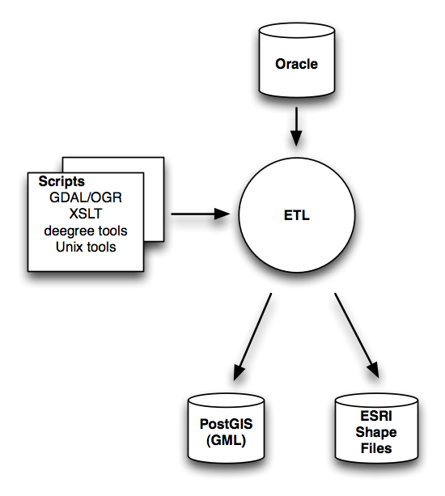

.. _design-etl:

************
Design - ETL
************

The concepts and architecture introduced in the previous chapters will be expanded below
for the ETL (Extract Transform Load) component.

ETL Design Overview
-------------------

   *Figure 7 - ETL - Overview*

Figure 7 sketches the ETL process at a high level. Starting point is the local source
data residing in (Kadaster) production Oracle databases. As a result of the ETL process
transformed data is stored in both PostGIS and ESRI Shapefiles. The data stored in PostGIS
is completely transformed INSPIRE data, i.e. GML v3.2.1 complying with the INSPIRE Annex I
(and ESDIN ExM) data specifications. In addition transformed data is stored as ESRI Shapefiles.
These Shapefiles are only used for INSPIRE View Services, i.e. WMS. The reason for using
Shapefiles is twofold: 1) to test the WMS 1.3 capabilities of the upcoming GeoServer
2.1 release, and 2) performance optimization. The ETL process is driven by various tools and
script files, most importantly:

* `GDAL/OGR <http://gdal.org>`_ - from the GDAL website: *"GDAL is a translator library for raster geospatial data formats that is released*
   *under an X/MIT style Open Source license by the Open Source Geospatial Foundation (www.osgeo.org). As a library, it presents a single abstract*
   *data model to the calling application for all supported formats.*
   *It also comes with a variety of useful commandline utilities for data translation and processing...*
   *The related OGR library (which lives within the GDAL source tree) provides a similar capability for*
   *simple features vector data."* Since our transformations deal with vector data the commandline utilities for OGR were
   used, in particular `ogr2ogr <http://gdal.org/ogr2ogr.html>`_ for both (file) format and coordinate
   transformations. In practice, GDAL/OGR is considered as the *Swiss Army knife* (in a metaphorical sense)
   of geodata manipulation and conversion.

* `XSLT <http://en.wikipedia.org/wiki/XSLT>`_ - the *EXtensible Stylesheet Language Transformations*. XSLT basically enables
   transformation from one XML format (schema) to another XML format (schema). Transformation
   rules are described in *XSLT script files*. An *XSLT Processor* takes an XML source file
   together with one or more XSLT script files and will produce a transformed XML output file.
   Most operating systems have a built-in commandline XSLT processor. For this project
   `xsltproc <http://xmlsoft.org/XSLT/xsltproc.html>`_ was used on both Mac OSX and Ubuntu Linux, but
   Windows OSs also have an XSLT processor command. XSLT was used for model transformations from local simple
   feature models to INSPIRE complex feature models.

* `deegree Tools <http://deegree.org>`_ - deegree not only provides W*S services but also several tools for various geoprocessing tasks. Within the project the ``FSLoader``, the Feature Store Loader
   was used. The FSLoader allows the loading of GML files into a deegree Feature Store
   in our case, a PostGIS database. FSLoader can use the same Feature Store configuration ("workspace") as the deegree WFS.

*  `Unix tools and scripts <http://en.wikipedia.org/wiki/Shell_script>`_  - the above tools are "glued" together through the
   use of Unix shell-scripts. In addition, several Unix command-line utilities were used
   for various small tasks like character set conversion (CP1252 to UTF-8) using
   `iconv <http://www.gnu.org/software/libiconv/documentation/libiconv/iconv.1.html>`_ and
   various string substitutions using `sed <http://www.gnu.org/software/sed/manual/sed.html>`_.

All ETL code can be found in the `source code repository <http://code.google.com/p/inspire-foss/source/browse/#svn%2Ftrunk%2Fetl>`_.

ETL Main Tool Chain
-------------------

The ETL tool chain for the Oracle to PostGIS transformation is depicted below in Figure 8.

.. figure:: _static/etl-design-chain1.png
    :align: center
    :width: 650 px

    *Figure 8 - ETL - Main Chain*

In Figure 8 the circles denote processing steps, the rectangles intermediate files. Arrows depict
the flow of data. The ETL processing steps (circles) are as follows:

#. *export* - this step was performed by the Kadaster organisation. Within the project access to the live
   Oracle database was not possible, hence extracts were obtained for source data sets. The format of the extracts
   was either `MapInfo TAB format <http://en.wikipedia.org/wiki/MapInfo_TAB_format>`_ or
   `ESRI Shapefile format <http://en.wikipedia.org/wiki/Shapefile>`_. So basically these files
   were the starting point of the ETL performed within the project.

#. *OGR* - in this step the tool ``ogr2ogr`` is used for both *coordinate transformation* and
   (file) format conversion. Coordinate transformation beholds the reprojection from
   the Dutch RD projection EPSG:28992 to an ETRS89 projection EPSG:4258. The file format conversion
   converts a MapInfo TAB or ESRI Shape file into a flat GML file, also known as an `OGC Simple
   Feature file <http://www.ogcnetwork.net/gml-sf>`_.

#. *XSL* - in this step the simple feature GML file is transformed into a complex feature INSPIRE GML file.
   This is the *model transformation*, i.e. from the local (national) data model to a standardized
   INSPIRE data model. This step has been designed to comprise two phases: 1) *extracting and assembling*
   required elements/attributes from the source XML, followed by 2) *GML generation*, i.e. generating the
   INSPIRE GML from the data assembled in phase 1. This design maximizes reuse, both within and over different data themes
   and over different national data models. Step 2, realized with *XSLT callable templates*, is generic, i.e.
   completely independent of the (national) source data model. This will be expanded further below.

#. *FSLoad* - in this step the complex feature INSPIRE GML file is loaded into the PostGIS database using FSLoader.
   Alternatively this step may be performed using a WFS-T web service of deegree. This step is independent
   from any national data model as it deals with INSPIRE GML only.

XSLT Design
-----------

The XSLT scripts that make up the "XSL" processing step described above have been structured
such as to maximize their reuse. The main design is depicted in Figure 9 below.

.. figure:: _static/etl-design-xsl.png
    :align: center
    :width: 650 px

    *Figure 9 - ETL - XSLT Design (illustrated for AU,CP,GN Annex I Themes)*

Figure 9 has been illustrated for the Annex I themes AU,CP and GN but all other
data themes follow the same design pattern. The rectangles each denote
one or more XSLT script files. The arrows denote dependencies and the
subsequent hierarchy of *XSLT template calls*, either implicitly through the XSLT statement ``apply-templates``
or explicitly through the XSLT statement ``call-template`` for named templates.
The input files for the XSL step are flat GML files generated from the "OGR"
step.

For each data theme one or more ``Spatialdatasets`` are generated. A Spatialdataset is a GML container
element similar to a GML ``FeatureCollection`` that can hold multiple individual GML features, in our
GML 3.2.1 data theme features such as ``CadastralParcel``. A
Spatialdataset is also the unit of transaction
that can be stored via deegree FSLoader (see above) or as the payload of a WFS-T
element such as ::

	<?xml version="1.0" encoding="UTF-8"?>
	<wfs:Transaction version="1.1.0" service="WFS" xmlns:wfs="http://www.opengis.net/wfs" ...>
	  <wfs:Insert handle="insert" idgen="UseExisting">

	  <!-- A FeatureCollection or SpatialDataset here -->

	  </wfs:Insert>
	</wfs:Transaction>

The top-level scripts named "Local GML to INSPIRE SpatialDataSet" will generate such
SpatialDataset files from the locally-specific GML simple features files. For each individual feature
the "Local <Theme> GML to INSPIRE GML" XSLT scripts are called. These scripts assemble
local data properties and geometries and will explicitly call the XSLT scripts
called "Generate ...". These "Generate ..." scripts will generate the required INSPIRE GML
using property values passed as parameters (XSLT callable templates allow parameter passing).
The "Generate ..." scripts may call on other "Generate ..." scripts, for example to generate
a common element type like a ``GeographicalName`` (shown in the Figure).

Finally a set of common XSLT scripts are shown that may be called by any XSLT script, for
example to generate an ``INSPIRE Id`` element from parameters, or
to generate a ``GMD.LocalisedCharacterString`` element.

The "Generate..." scripts and several global XSLT scripts are generally reusable, i.e.
independent from the local(e.g. NMA-specific) data formats. Additional reusability is effected
by calling XSLT scripts for cross-theme elements like ``GeographicalName`` and basic
elements like ``InspireId``  or converting GML2 geometries to GML 3.2.1 geometries.

ESRI Shapefile creation
-----------------------

As indicated above ESRI Shapfiles are generated with the ETL process. The main two reasons being
boosting WMS performance and testing the WMS 1.3 capabilites recently added to GeoServer.  The steps are depicted in Figure 10 below.

The processing steps are simpler and depincted in Figure 10 below.

.. figure:: _static/etl-design-chain2-esri-shape.png
    :align: center
    :width: 350 px

    *Figure 10 - ETL - Create ETRS89 ESRI Shape files*

The first *export* step is identical to the export step in Figure 8 above. The *OGR* step will
convert the result from the export to an ETRS89-projected (EPSG:4258) ESRI Shapefile. In the case
where multiple Shapefiles are present from the export, in particular with Top10NL "kaartbladen"
the OGR-step will also merge multiple ESRI Shapefiles into a single file.

ESDIN ExM (Large Scale) Transformation
--------------------------------------

"ExM" denotes datamodels for European-wide topographic data and administrative boundaries. ExM is defined within
`ESDIN <http://www.esdin.eu>`_ for 2 scales: ExM Medium and Small Scale (ExM MSS defined in `ESDIN WP6 <http://www.eurogeoforum.eu/taxonomy/term/4>`_) and ExM Large Scale
(ExM LS defined in `ESDIN WP7 <http://www.eurogeoforum.eu/taxonomy/term/5>`_).

For interworking purposes in `ESDIN WP11 <http://www.eurogeoforum.eu/taxonomy/term/8/all>`_ ExM (Large Scale)
transformation and WFS has been developed within our project. Since ExM Large Scale is currently based
as extensions of the INSPIRE Annex I themes AU, CP, GN, HY and TN, the GML resulting from the
main ETL process chain above was used as the starting point. The main reason is that
the current (v1.0 january 2011) ExM LS version extends features from INSPIRE Annex I themes
but does currently not add extra elements nor properties. The main transformation to be applied
are changes in XML Namespaces. This can be easily effected through the use
of `sed <http://www.gnu.org/software/sed/manual/sed.html>`_.

Tools
-----

For the purpose of the developed ETL, several generic tools and scripts have been developed.

ETL Shell Scripts
^^^^^^^^^^^^^^^^^

All the above ETL is executed through the use of Unix Shell Scripts. These have been structured
such that a single script ``etl.sh`` will perform all ETL for all datasets/themes.
``etl.sh`` will mainly call the ETL scripts for each INSPIRE Data Theme, called ``<theme>-etl.sh`` for example
for CP this script is called ``cp-etl.sh``. Each Theme in turn will call three scripts: one for
Extract (``<theme>-extract.sh``), one for Transform (``<theme>-transform.sh``) and finally one
script for Load (``<theme>-load.sh``). Finally each theme has a transformation shell script
called ``local-to-inspire-<theme>-sd.sh`` that will invoke the XSLT processor ``xsltproc``.
The total shell/XSLT script hierarchy thus is as below. Here the ETL hierarchy for CP is completely expanded ::

  etl.sh
    au-etl.sh
      au-extract.sh
         .
         .

    cp-etl.sh
      cp-extract.sh
        to-shape.sh
          ogr2ogr
        to-gml.sh
          ogr2ogr
      cp-transform.sh
        local-to-inspire-cp-sd.sh
          xsltproc
            local-to-inspire-cp-sd.xsl
              local-to-inspire-cp.xsl
                CadastralParcels.xsl

      cp-load.sh
        fsload.sh
          deegree FSLoader

     gn-etl.sh
       gn-extract.sh
         .
         .

See also the `bin directory <http://code.google.com/p/inspire-foss/source/browse/#svn%2Ftrunk%2Fetl%2FNL.Kadaster%2Fbin>`_.

FSLoader Wrapper
^^^^^^^^^^^^^^^^

In order to facilitate calling the deegree FSLoader a wrapper shell script ``fsload.sh``.
This script mainly does some CLASSPATH settings and will call the deegree
Java tools program with FSLoader options.

See also the `Loader source code <http://code.google.com/p/inspire-foss/source/browse/#svn%2Ftrunk%2Ftools%2Floader>`_

Transformation Validation
^^^^^^^^^^^^^^^^^^^^^^^^^

In order to validate the GML resulting from the above ETL processes, a GML validator has been
developed. The ``Validator`` is a Java program that executes the Java platform
built-in XML parser with all validation options set. The Validator
will download the referenced XSD schema files available at http://schema.kademo.nl.

See also the `Validator source code <http://code.google.com/p/inspire-foss/source/browse/#svn%2Ftrunk%2Ftools%2Fvalidator>`_.

