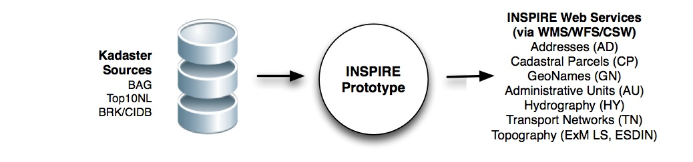

.. _introduction:

************
Introduction
************

This document assumes that the reader is familiar with the `EU INSPIRE Directive <http://inspire.jrc.ec.europa.eu>`_
and its organization of specifications. Of particular importance are the "spatial data themes", also known
as "INSPIRE Annexes" and the INSPIRE Network Services.
Within The Netherlands,
`Geonovum  <http://www.geonovum.nl>`_ coordinates INSPIRE activities.
A clear explanation (in Dutch) of INSPIRE can be found  `on the Geonovum website <http://www.geonovum.nl/dossiers/inspire>`_.

The Dutch Kadaster (Eng: Cadastre, Land Registry and Mapping Agency) is a so
called "Legally Mandated Organisation (LMO)" within the INSPIRE context
(see `Kadaster LMO entry on inspire.jrc.ec.europa.eu <http://inspire.jrc.ec.europa.eu/index.cfm/pageid/42/list/6/id/1484>`_.

*"Legally Mandated Organisations (LMOs) are all the Member States' public authorities, institutions and bodies who already have
or will get a legal mandate to set up and run one or some of the components of national and regional SDIs, and which are eligible
to become the MS' contributors to the
INSPIRE for a particular component. These components cover all fields of activity targeted by INSPIRE and can be either of a technical nature,
or of a policy and organisation related nature."* (from http://inspire.jrc.ec.europa.eu).

One of the implications is that The Kadaster is responsible for providing (web) services for
several of the Annex I-III specifications, i.e. those data themes related to the data sets
it maintains (in Dutch "bronhouder"). An obvious example of such a data set are cadastral parcels.
Within INSPIRE a spatial data theme defined in Annex I is called
Cadastral Parcels (CP), specifying a spatial data model for cadastral parcel data.
The format in which INSPIRE data themes are specified are
`ISO (GML) Application Schemas <http://en.wikipedia.org/wiki/GML_Application_Schemas>`_. LMOs are required
eventually (according to INSPIRE schedules) to provide their data according to the INSPIRE-specified formats.

This requirement obviously creates a challenge: local data defined according to national data schemas needs to
be `transformed` in order
to conform to the INSPIRE application schemas.
In addition, INSPIRE prescribes the use of common geospatial
projections like: `ETRS89 <http://en.wikipedia.org/wiki/European_Terrestrial_Reference_System_1989>`_,
also known as `EPSG:4258 <http://spatialreference.org/ref/epsg/4258/>`_, thus also a reprojection of Dutch
local data coordinates is required.

Another challenge is that LMOs such as The Dutch Kadaster are required to provide so called
"Download Services" and "View Services" for INSPIRE-conformant data.
One of the standards that is applied for INSPIRE Download Services,
is the `Web Feature Service (WFS, v2.0) <http://en.wikipedia.org/wiki/Web_Feature_Service>`_.
One of the standards that is applied for INSPIRE View Services,
is the `Web Map Service (WMS, v1.3) <http://en.wikipedia.org/wiki/Web_Map_Service>`_.

In summary, The Dutch Kadaster needs to develop
WMSs and WFSs for several of the Annex I-III INSPIRE (mainly Annex I) data themes.
INSPIRE defines also other Network Services such as for metadata,
processing. Although the INSPIRE directive does not mandate specific implementation technologies,
a clear preference for Free and Open Source Software (FOSS) can be read inbetween the lines.
As we have been very successful using FOSS in Phase 1 of this project we will be continuing
this road taken, and will in addition apply an open FOSS-style development process (see below).

   *Figure 1 - Project Scope*

INSPIRE does not specify particular approaches to realize these transformations and services. Obviously, there is a need
for sharing ideas and best practices and to conduct interworking testing among LMOs.
This is where consortia such as `EURADIN <http://www.euradin.eu>`_ and
`ESDIN <http://www.esdin.eu>`_  provide for. The work carried out in our project was conducted as part of
ESDIN Workpackage 11 (WP11). (Work on Addresses (AD) was performed in Phase 1 in the context of EURADIN).

This document will describe how an INSPIRE-conformant data transformation (ETL) and web services for WMS and WFS
have been successfully realized within The Dutch Kadaster.
For example, within ESDIN WP11 The Kadaster was the first member that has
provided fully INSPIRE-conformant from a WFS.

Although this project was specific for the Dutch Kadaster, other LMO's and National Mapping Agencies
may benefit and reuse findings and assets from this project (see next).

Last but not least external components/tools used within this project were developed with Free and Open Source Software
(FOSS). All assets (code, documentation, tests) produced by this project are licensed under the GNU Public License v3
and available at the FOSS projects
http://code.google.com/p/inspire-foss (ETL, services) and http://code.google.com/p/geoext-viewer (web-based viewer).
Documentation, including this document falls under the
Creative Common License `CC by-NC-SA <http://creativecommons.org/licenses/by-nc-sa/3.0/>`_.

Subsequent chapters in this document will describe the requirements, concepts, architecture and implementation details of this
project.

