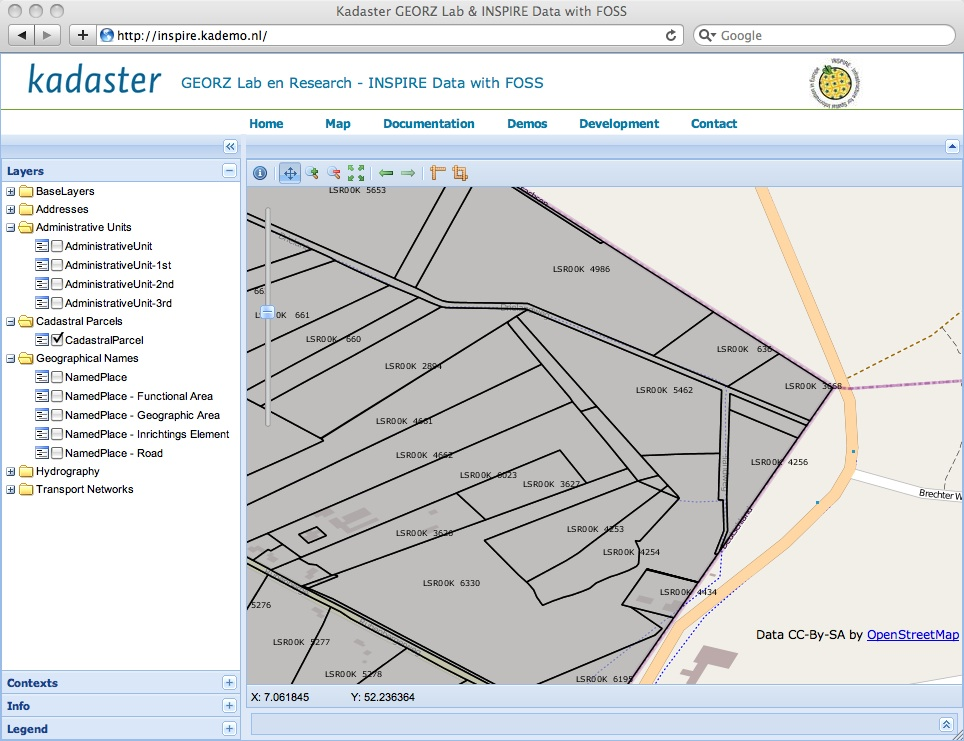
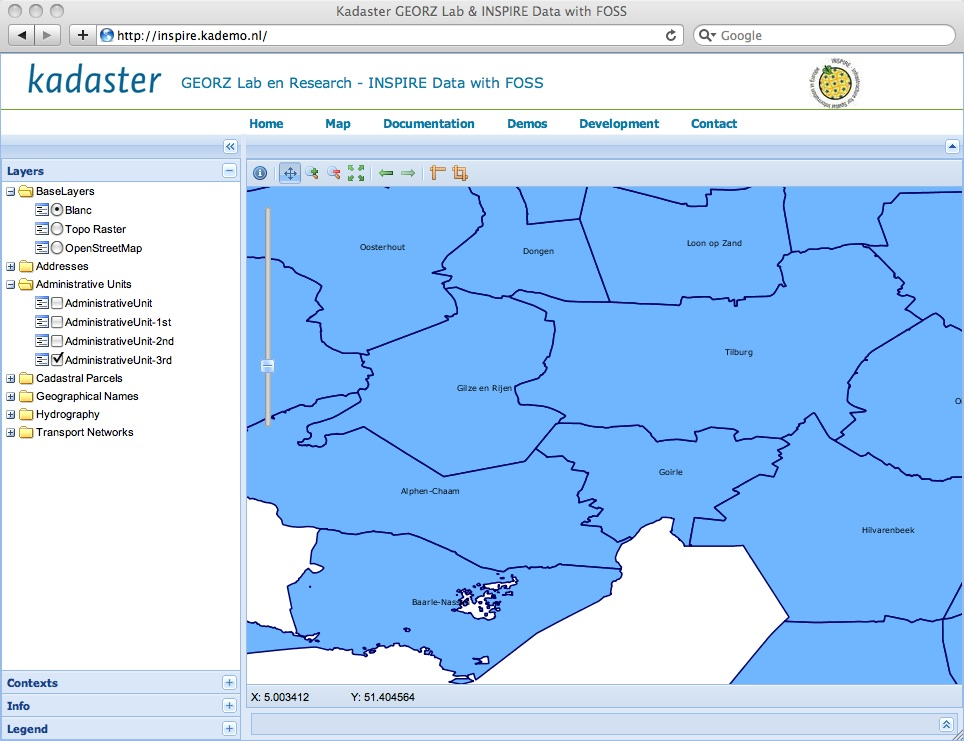

.. _results:

*******
Results
*******

This chapter summarizes the main results, organized by the different
components of the project. Most of these results can be accessed directly through the
project site http://inspire.kademo.nl.

ETL
===

The ETL process for each of the data themes and ExM together has resulteed in around 500000 features
stored into the PostGIS datastore maintained by a deegree WFS (see next).

Download Services - WFS
=======================

A deegree v3 WFS is currently active providing
INSPIRE-compliant data for Administrative Units (AU), Cadastral Parcels (CP), GeographicalNames (GN), Hyrdography (HY) and Transport Networks (TN).

Data from this WFS has been validated successfully
against the INSPIRE Annex I V3 schemas and ESDIN ExM Large Scale (GML 3.2.1/WFS 1.1.0).

The WFS is located at `<http://inspire.kademo.nl/deegree3>`_.

Below are some sample WFS (GET) requests that can be directly executed on the live WFS.

.. * `WFS GetCapabilities <http://inspire.kademo.nl/deegree3/services?SERVICE=WFS&VERSION=1.1.0&REQUEST=GetCapabilities>`_
* `WFS Administrative Units - GetFeature <http://inspire.kademo.nl/deegree3/services?request=GetFeature&version=1.1.0&service=WFS&typeName=au:AdministrativeUnit&namespace=xmlns%28au=urn:x-inspire:specification:gmlas:AdministrativeUnits:3.0%29&maxFeatures=5&outputFormat=text/xml;%20subtype=gml/3.2.1>`_
* `WFS Cadastral Parcels - GetFeature <http://inspire.kademo.nl/deegree3/services?SERVICE=WFS&VERSION=1.1.0&REQUEST=GetFeature&TYPENAME=CP:CadastralParcel&maxfeatures=50&NAMESPACE=xmlns%28CP=urn:x-inspire:specification:gmlas:CadastralParcels:3.0%29&maxFeatures=10&outputFormat=text/xml;%20subtype=gml/3.2.1>`_
* `WFS GeographicalNames - GetFeature <http://inspire.kademo.nl/deegree3/services?request=GetFeature&version=1.1.0&service=WFS&typeName=GN:NamedPlace&namespace=xmlns%28GN=urn:x-inspire:specification:gmlas:GeographicalNames:3.0%29&maxFeatures=10&outputFormat=text/xml;%20subtype=gml/3.2.1>`_
* `WFS Hydrography - GetFeature <http://inspire.kademo.nl/deegree3/services?request=GetFeature&version=1.1.0&service=WFS&typeName=hy-p:Watercourse&namespace=xmlns%28hy-p=urn:x-inspire:specification:gmlas:HydroPhysicalWaters:3.0%29&maxFeatures=10&outputFormat=text/xml;%20subtype=gml/3.2.1>`_
* `WFS Transport Networks - GetFeature <http://inspire.kademo.nl/deegree3/services?request=GetFeature&version=1.1.0&service=WFS&typeName=tn-ro:RoadNode&namespace=xmlns%28tn-ro=urn:x-inspire:specification:gmlas:RoadTransportNetwork:3.0%29&maxFeatures=10&outputFormat=text/xml;%20subtype=gml/3.2.1>`_

View Services - WMS
===================

In order to view data a WMS using the ETRS89 (EPSG:4258) projection was setup using GeoServer.
Dutch raster topomaps
and `OpenStreetMap <http://www.openstreetmap.org>`_  tiles are used as baselayers.
The Dutch Kadaster GEORZ Lab is developing a
generic (WMS) view-client as a FOSS project
see http://code.google.com/p/geoext-viewer. This viewer, called GeoViewer is based on `GeoExt <http://www.geoext.org>`_.

In the figures below some screenshots of GeoViewer adapted for INSPIRE data viewing are shown.
This viewer can be directly accessed through
http://inspire.kademo.nl.

    *Figure 12 - WMS Showing CadastralParcels near Dutch/German border*

.. figure:: _static/viewer-gn-hy-tn.jpg
    :align: center
    :width: 650 px

    *Figure 13 - WMS Showing Features from GN, HY and TN*

    *Figure 14 - WMS Showing 3rd-Level Admin Units (Dutch: "Gemeenten")*
