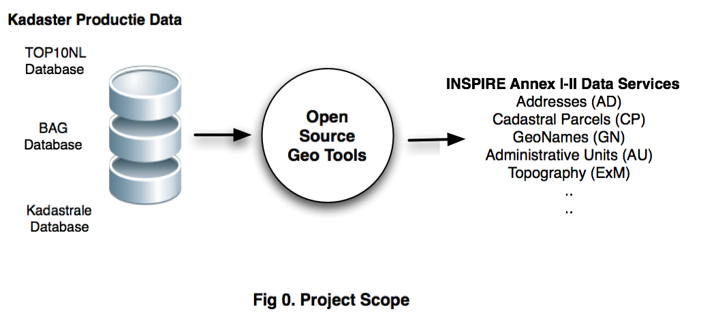

.. _introduction:

************
Introduction
************

This document assumes that the reader is familiar with the `EU INSPIRE Directive <http://inspire.jrc.ec.europa.eu>`_
and its organization of specifications into spatial data themes, also known as "Annexes". Within The Netherlands,
Geonovum coordinates all INSPIRE activities. A clear explanation (in Dutch) of INSPIRE can be found  `on the Geonovum website <http://www.geonovum.nl/dossiers/inspire>`_.

The Dutch Kadaster is a so called "Legally Mandated Organisation (LMO)" within the INSPIRE context. This implies
that The Kadaster is responsible for providing (web) services for Annex I-III specifications related to the data sets it maintains
(in Dutch "bronhouder"). An obvious example of such a data set are cadastral parcels. Within INSPIRE a spatial data theme defined in Annex I is called
Cadastral Parcels (CP) specifying a spatial data model for cadastral parcel data.
The format in which INSPIRE data are specified are `ISO (GML) Application Schemas <http://en.wikipedia.org/wiki/GML_Application_Schemas>`_. LMOs are required
eventually (according to the INSPIRE schedules) to provide their data according to the INSPIRE-specified formats.

This requirement obviously creates a challenge: local data defined according to national data schemas needs to be `transformed` in order
to conform to the INSPIRE application schemas.
In addition, INSPIRE prescribes the use of a common geospatial projection: `ETRS89 <http://en.wikipedia.org/wiki/European_Terrestrial_Reference_System_1989>`_,
also known as `EPSG:4258 <http://spatialreference.org/ref/epsg/4258/>`_, thus also a reprojection is required.

Another challenge is that LMOs such as The Dutch Kadaster are required to provide so called "Download Services" for INSPIRE-conformant data.
One of the standards that is applied for Download services, is the `Web Feature Service (WFS) <http://en.wikipedia.org/wiki/Web_Feature_Service>`_.

In summary, The Dutch Kadaster needs to develop
WFSs for several of the Annex I-III INSPIRE data themes. INSPIRE defines and mandates also other services such as for metadata,
processing and viewing but these are (currently) outside the scope of our project.

INSPIRE does not specify particular technologies to realize these transformations and services. Obviously, there is a need
for sharing ideas and best practices and to conduct interworking testing among LMOs.
This is where consortia such as `EURADIN <http://www.euradin.eu>`_ and
`ESDIN <http://www.esdin.eu>`_  provide for. The work carried out in our project was conducted as part of EURADIN Workpackage 7 (WP7)
and ESDIN Workpackage 11 (WP11).

This document will describe how an INSPIRE-conformant WFS serving data for Annex I themes Addresses (AD) and Cadastral Parcels (CP)
has been successfully realized within The Dutch Kadaster. For example, within ESDIN WP7 The Kadaster was the first member that has
provided fully INSPIRE-conformant address-data (AD) from a WFS. In particular, local address data (BAG) and cadastral parcel data (BRK) was
transformed to INSPIRE-conformant data using Combined Transformation, an architectural approach expanded further in this document.

Last but not least this WFS and all related components were all developed with Free and Open Source geospatial software (GeoFOSS).

Subsequent chapters in this document will describe the requirements, architecture and further details of the WFS implementation.

