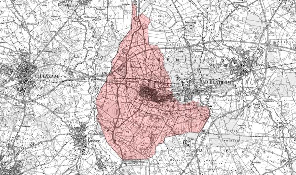

.. _projects:

********
Projects
********

The results of this project have been further used, expanded, tested in several other projects. These are described here.

ESDIN WP11 - Edge Matching Service
==================================

This project is part of the ESDIN project.

Cadastral Parcel (CP) data available in the INSPIRE schema via WFS from the mapping agency in Lower Saxony (LGN) in Germany
and the Dutch Kadaster in the Netherlands will be used for an edge-matching service implementation. The cross-border area
as depicted in the image below has been chosen.

.. figure:: _static/inspire-cp-xborder-gmap.png
   :align: center

*Figure 8 - Target Area for Cross-Border edge-matching for Cadastral Parcels*

Saxony has CP data available in the following area.

*Figure 9 - Area with parcel data available from Saxony (Germany)*

The area to be taken for The Netherlands will be the following 10x10 km bounding box (lower left, upper right). ::

  EPSG:28992 (Dutch RD) :    260000,     470000      270000,     480000
  EPSG:4258  (ETRS89)   :    6.923427,   52.20809    7.07307706, 52.29594227

ETL Process
-----------

The ETL is slightly adapted, since data is now originating from a PostGIS database containing
Dutch parcel data in the local "LKI" format.  Several scripts have been made to facilitate this
process. These can be found `in the Google Code project SVN <http://code.google.com/p/inspire-foss/source/browse/#svn/trunk/ETL/NL.Kadaster/parcels/lki>`_

The ETL chain is as follows:

#. extract data from local PostGIS into GML (``lki2gml.sh`` using GDAL ``ogr2ogr``)
#. convert GML to SQL (``gml2sql.sh`` using XSLT)
#. insert SQL into (existing) target INSPIRE PostGIS DB (``sql2pg.sh``)

The script ``etl-lki.sh`` allows you to extract a specific area indicated
as a bbox in Dutch EPSG:28992 (RD Rijks Driehoeksmeting coordinates.

For example ``etl-lki-losser.sh`` does ETL for a 10x10 km area near Losser (Gelderland). Next are more script details.

The results are about 18000 parcels inserted into the target INSPIRE database.

ETL Scripts
-----------

This script transforms a given area (bbox) from LKI in PostGIS
to INSPIRE data in the target INSPIRE PostGIS database.

.. literalinclude:: ../ETL/NL.Kadaster/parcels/lki/etl-lki.sh
    :linenos:

For example below is the script to extract a 10x10 km area near Losser (Gld).

.. literalinclude:: ../ETL/NL.Kadaster/parcels/lki/etl-lki-losser.sh
    :linenos:

The specific scripts for the 3 steps described in the previous section are
as follows.

This script transforms a given area (bbox) from the source PostGIS into GML.

.. literalinclude:: ../ETL/NL.Kadaster/parcels/lki/lki2gml.sh
    :linenos:

This script transforms from GML into target INSPIRE database SQL.

.. literalinclude:: ../ETL/NL.Kadaster/parcels/lki/gml2sql.sh
    :linenos:

This script simply inserts the SQL data from the previous step into the target PostGIS DB.

.. literalinclude:: ../ETL/NL.Kadaster/parcels/lki/sql2pg.sh
    :linenos:

Results
-------

This is the WFS capabilities URL is `<http://inspire.kademo.nl/deegree-wfs/services?service=WFS&version=1.1.0&request=GetCapabilities>`_.

The WFS data has been made made visible via a WMS (for now using Geoserver). See the Map on `<http://inspire.kademo.nl>`_. In the left colums select "Contexts"
and click the context refering to "Losser".

.. figure:: _static/inspire-cp-xborder-losser-s.png
   :align: center

*Figure 10 - Area with parcel data available around Losser (Netherlands)*

Is this a Dutch cow watching over Germany :-) ?

