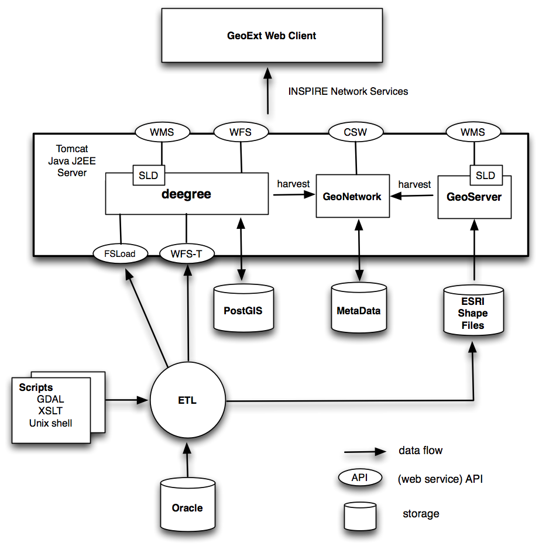

.. _architecture:

************
Architecture
************

The concepts introduced in the previous chapter provides the basis for
the software architecture. The overall architecture is depicted in the Figure below.

   *Figure A1 - Overall Architecture*

The bottom part of Figure 3 shows the Extract Transform Load (ETL) discussed
in the Concepts chapter. The top part of this figure shows the realization of the various
OGC/INSPIRE-compliant web services (CSW, WFS and WMS). Although meta-data is not part of this project
a possible relationship with a
`GeoNetwork meta data server <http://geonetwork-opensource.org/>`_ is depicted.

The server is based on the `Apache Tomcat J2EE server <http://tomcat.apache.org/>`_. This server
provides a (J2EE) container in which application servers like GeoServer, GeoNetwork or Deegree are deployed.

ETL
===

TO BE FINALIZED

