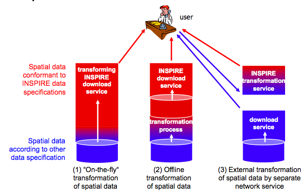
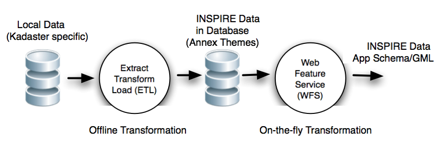

.. index:: INSPIRE, Transformation, Combined Transformation, EURADIN, ESDIN, Download Service, deegree, Geonovum

.. _bestpractices:

**************
Best Practices
**************

This section discusses
best practices for one of the core issues within any INSPIRE implementation:
Content Transformation for Download (WFS) and View Services (WMS).

An introduction to Content Transformation for INSPIRE
is given in the `videos on INSPIRE Transformation <http://www.youtube.com/user/inspireEU>`_
created by the `INSPIRE JRC <http://inspire.jrc.ec.europa.eu>`_.
The `Geonovum Wiki <http://geostandards.geonovum.nl/index.php/6.4.2_Interoperability_of_spatial_data>`_ describes
issues surrounding the interoperability and transformation of spatial data as recommended by the INSPIRE Directive.

Several best practices on INSPIRE content transformation have evolved, in
particular from the work within `ESDIN WP11 <http://www.esdin.eu>`_ and experiences gained in
`Phase 1 of the Kadaster INSPIRE Prototypes project <http://inspire.kademo.nl/docold/phase1>`_.

Content Transformation
from (NMA) local data can be divided into 2 separate transformations:

#. data model transformation from the local format to the INSPIRE data theme (GML) format
#. coordinate transformation from the local projection to INSPIRE-mandated projection like ETRS89 (EPSG:4258)

The core issue is when, where and how to apply these transformations within the data flow
from local source data to INSPIRE data as delivered to the end-user.

INSPIRE - Interoperability and Transformation
=============================================

According to the INSPIRE Directive there are three alternative approaches to transformation.

#. "On-the-fly" transformation of the spatial data on request in the View and Download service
#. Offline transformation of spatial data and provision of the transformed data
#. Provision of the source data as-is via the View and Download service and transformation of the spatial data by a separate transformation service

This is depicted in the figure below.

    *Figure 1 - INSPIRE Transformation Approaches (from the Geonovum Wiki)*

The first two alternatives are more or less straightforward. The third
alternative has been left for future study within our project.

ESDIN WP11 - Best Practices
===========================

The "transformation issue" and various
architectural approaches have been described extensively within the ESDIN WP11 Deliverable D11.1 (ECP-2007-GEO-317008),
called *"Best Practice for Content Transformations
Enabling INSPIRE-Compliant Data Delivery"* (author Lassi Lehto et al).
Unfortunately this document is not freely available online, but below is a quote from the Executive Summary:

*"The content transformation types dealt (within this document) include data model transformation and coordinate transformation, and are
discussed in the context of the INSPIRE Download Service. All relevant architectural approaches to the process of content
transformation are considered. These include transformations on the database level, between databases, carried out by a
Download Service, a cascading Download Service or a dedicated Transformation Service, or performed in a portal or client
application. The discussion includes both off-line, on-the-fly and combined transformation methods. The transformation process
is also described, with special emphasis put on the encoding of the schema mapping instructions.*

*Off-line transformation approaches seem to provide the best possible robustness and performance levels for online data delivery.
A major challenge in this approach is to keep the separate service database up-to-date. On-the-fly content transformation methods
are seen as a solution for this challenge and can be regarded as the only feasible approach in cases involving large amounts of
frequently updated content. A combined alternative for transformation includes both off-line and on-the-fly processing steps
into the workflow.*

*Various tools are available for performing content transformations. These include both commercial and open source products.
The testing carried out in the context of ESDIN project include the following products capable of data model transformations:
FME Desktop/Server, Radius Studio, GO Loader/Publisher, XtraServer and deegree. In addition transformations were carried out
based on SQL and XSLT scripting.*

*The results from the testing suggest that many of the transformation types required for achieving INSPIRE-compliancy are
too complicated or time consuming for the on-the-fly approach. Only 40% of the tests carried out were at least partially
based on on-the-fly processes. The project results so far seem to suggest that a combined solution, in which both off-line
and on-the-fly processes are utilized, is the most promising one.*

*A method that relies on the idea of maintaining various different data schemas inside a single DBMS has been identified
in the project as a new kind of solution for INSPIRE-compliant data delivery. The updates from the primary schema to
the secondary one could be based on automated database triggers, activated when modifications are done on the primary
data set. The approach can be seen as an interesting compromise between permantent data adaptation and the various
transformation-based approaches."*

Combined Transformation within Phase 1 of this project
======================================================

Our approach in Phase 1 applied the *Combined Transformation* as defined within ESDIN WP11 as the basis.
See `Phase 1 documentation <http://inspire.kademo.nl/docold/phase1>`_ for details.

This included a combination
of *offline transformation* into an intermediate data format, followed by an *on-the-fly transformation* into
the INSPIRE data theme format. This is depicted below.

    *Figure 2 - Combined Transformation*

Figure 2 shows Combined Transformation as applied within Phase 1 of our project. The arrows denote the flow of data
from local sources (left) up to INSPIRE-compliant data coming out of a WFS. The circles denote processing steps. The database
symbols depict data(base) storage.

On the left in Figure 2 we have data stored in local databases. Within the Dutch Kadaster data resides in Oracle according to
local database models. The first (offline) transformation step is called ETL (`Extract Transform Load <http://en.wikipedia.org/wiki/Extract,_transform,_load>`_). As a result of this step
data is stored within a separate database that we will call here an "INSPIRE-database". For this "INSPIRE-database" we defined
(RDBMS) data models directly
based on and thus very close to the INSPIRE Annex I-III data models.
The ETL process used in the offline transformation is realized as follows:

* Extract: data is extracted/exported from the database into XML
* Transform: XML data is transformed with XSLT into INSERT/UPDATE statements for the "INSPIRE-database"
* Load: the resulting INSERT statements are executed

As a result from the offline ETL-steps data is loaded within the intermediate INSPIRE database. Note that since we use
a spatial database (PostGIS), the ETL-step also provides coordinate reprojection from Dutch RD (EPSG:28992) to ETRS89 (EPSG:4258)
through the generation of reprojection functions (ST_Transform) within the database INSERT statements.

The last (on-the-fly) transformation takes place within an application server (Deegree or GeoServer2) supplying a WFS. This
WFS is configured to transform data from the "INSPIRE-database" to the INSPIRE Annex I-II Application Schema data.
Our WFS was initially based on the `PostGIS/Deegree pilot approach <_static/euradin-wp7-wfs-pilot.pdf>`_  kindly provided by the
Norwegian Mapping and Cadastre Authority (NMCA)
within EURADIN WP7.

Figure 3 below depicts all steps in detail with Deegree as the WFS.

.. figure:: _static/combined-trans-concept-exp.jpg
   :align: center
   :width: 650px

   *Figure 3 - Combined Transformation - Expanded View*

The above sketches the basic concept. This was further elaborated into an implementation
for the Annex I Data Themes Addresses and Cadastral Parcels.
The implementation is available at http://code.google.com/p/inspire-foss/source/browse/#svn%2Ftrunk%2Fphase1

More detail can also be found within our article that is to be published:
http://ijsdir.jrc.ec.europa.eu/index.php/ijsdir/article/view/181.

Pros and Cons of Combined Transformation
----------------------------------------

At the time of the Phase 1 project we listed the following advantages and
disadvantages of Combined Transformation.

Pros
----

* the complex transformation problem has been reduced into two manageable sub-problems
* have a single integrated/clean/understandable INSPIRE-theme database model
* reusable setup, also for other National Mapping Agencies (NMAs), i.e. only the offline transformation to the database model is locally (NMA)-specific
* database provides reuse for common themes such as GeoNames (GN) and Administrative Units (AU)
* provide for *cross-theme relationships* through foreign keys, such as Addresses (AD) referencing Cadastral Parcels (CP)
* optimized for performance (e.g. no on-the-fly reprojections)
* easy to work with reusable test data
* local datasets that were locally separate like Dutch BAG (Addresses) and BRK (Cadastral Parcels) and Top10NL can now be integrated

Cons
----
* keeping mutations of local data in sync with INSPIRE-theme database
* the intermediate data model may become complex and would require additional maintenance

Discussion and Further Work
===========================

On-the-fly transformation seems to be theoretically the most attractive: data is maintained/mutated only
at the source  and transformation would take place "automagically" during each Download or View Service
request. Though this may surely be feasible for simple Data Themes like Cadastral Parcels, there
are some practical and integration issues tied to on-the-fly transformation:

* the transformation problem is not simply a model/coordinate transformation but more often a query transformation,
  e.g. an arbitrary complex WFS Filter needs to be translated to a local DB query (or worse N queries/table joins).
  While this may be feasible for simple themes like CP, this can become unwieldy complex for more
  complex data themes such as Addresses (e.g. in a Gazetteer-like services) and Transport Networks (think of topologies).
* related to the above issue: performance will be severely impacted, not as much for bounding box queries
  but for complex WFS filters.
* *cross-theme relationships* are very hard to realize as theme data may reside in different local databases, for example
  within the Netherlands, Addresses (BAG or ACN) and Cadastral Parcels (BRK)
* the setup/architecture will be ad-hoc for each data theme and hardly reusable. Cases of On-the-fly transformation have been observed where a separate WFS was created for each Data Theme.

Many GIS data applications have datasets that are exported/remodelled to suit
the type of application.

Combined Transformation has worked well for us in Phase 1 of this project and we initially
continued with this approach in Phase 2. For several reasons however we
moved to "offline transformation" combined with native GML storage:

* the intermediate data model and mapping became more and more complex
* advances in technology for the publication, (GML) storage and download of native GML data within the WFS engine `deegree v3 by lat/lon <http://www.deegree.org>`_

The idea of an "INSPIRE Service Node" more and more became a very attractive option. Basically in this setup
three functions are involved:

* publication: publish INSPIRE GML to the Node (e.g. via WFS-T)
* maintain native INSPIRE (GML) data
* support Download (WFS) and View (WMS) services

Transformation would now be a completely offline process, as part of an "Extract, Transform, Load (ETL)" chain.
This implies that we have two separate funtions to deal with:

* ETL : taking local data (E), transform to INSPIRE (T) and publish to INSPIRE Node (L)
* the INSPIRE Node

This is also depicted in the next Figure below.

.. figure:: _static/deegree3-inspire-etl.jpg
   :align: center

   *Figure 4 - Offline Transform with Generic (deegree) INSPIRE Node*

The "INSPIRE Service Node" setup is described at several places:

* deegree website: http://wiki.deegree.org/deegreeWiki/InspireNode
* presentation (Bolsena, June 2010): `PDF <http://www.justobjects.nl/jo/assets/presentation/bolsena-2010-inspire/bolsena-2010-inspire-just.pdf>`_

This setup will be expanded in the next :ref:`Concepts` section.

