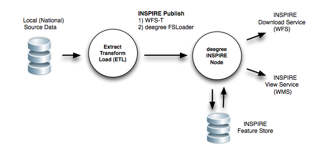

.. _concepts:

********
Concepts
********

This chapter describes the core concepts and approaches to the functional requirements
listed in the :ref:`Requirements` and builds further on the :ref:`bestpractices` section.
Emphasis is on Content Transformation and Download Services via WFS. These concepts will lead towards a
software architecture described in the :ref:`Architecture` section.

Core Concept : ETL + INSPIRE Node
=================================

The integrated combination of two process components realizes the entire chain of Content Transformation and
INSPIRE Download/View Services:

1. an ETL (Extract Transform Load) process that

  * Extracts data from a local source database
  * Transforms this data to INSPIRE Data theme GML
  * Loads (publishes) the INSPIRE Data theme GML into an "INSPIRE Node"

2. the "INSPIRE Node" process, basically a WFS/WMS that allows for

  * publication of INSPIRE Data theme GML (e.g. via WFS-T)
  * storage of INSPIRE Data theme GML (e.g. using PostGIS or Oracle Spatial)
  * download of INSPIRE Data theme GML via WFS
  * viewing of INSPIRE Data theme GML via WMS (optional)

This is illustrated in Figure 4 below, using `deegree <http://deegree.org>`_ as the
"INSPIRE Node".

   *Figure 4 - Core concept with ETL + deegree INSPIRE Node*

The basic scenario is described next.

The ETL process extracts data from a local source dataset/database and
transforms this data into valid ISNPIRE data theme GML. This includes coordinate transformation (to ETRS89).
As the last step of the ETL process INSPIRE-compliant GML data
is published to the (deegree) INSPIRE Node, either using WFS-T (WFS-Transactional, a standardized way to
publish data remotely via the WFS protocol) or via a deegree tool called *FSLoader*.

The INSPIRE Node
takes care of storing GML data into an "INSPIRE Feature Store", usually a
database like PostGIS or Oracle Spatial. The storage format/schema is internal to
the INSPIRE Node, thus transparent to the user. Finally the INSPIRE Node will provide a WFS
to realize Download services. On addition a WMS can be configured
(using Styled Layer Descriptors) to provide INSPIRE View services via WMS.

This concept will be expanded further below and subsequent sections of this document.

